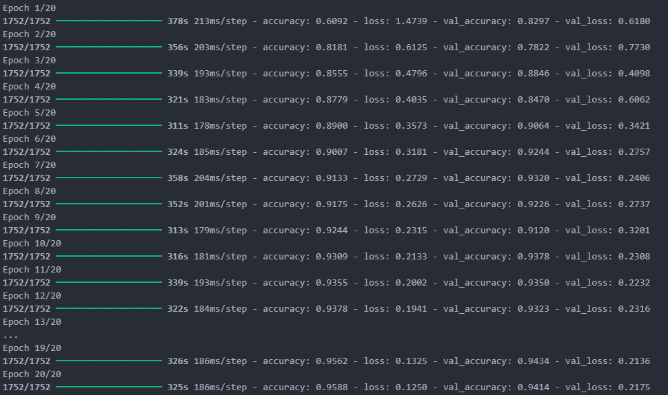

# 🇦🇲 Armenian Alphabet Recognition (CNN)

### 📂 Dataset Source
**This project is a Kaggle exercise using the Mashtots Dataset.** You can find the competition and download the 70,000+ images here: 
[Kaggle - Mashtots Dataset Competition](https://www.kaggle.com/competitions/mashtots-dataset)

---

[](https://www.python.org/)
[](https://www.tensorflow.org/)
[](https://www.kaggle.com/competitions/mashtots-dataset)

An end-to-end Computer Vision pipeline designed to classify Armenian alphabet characters (both uppercase and lowercase) using a Convolutional Neural Network.

---

## 🧠 Project Overview
The dataset consists of approximately **70,000 images**. The goal is to accurately recognize the unique characters of the Armenian alphabet. By leveraging `TensorFlow` and `Keras`, this model achieves high-performance classification through a deep architecture optimized for image recognition.

### Key Technical Details:
* **Architecture:** Sequential model using `Conv2D`, `BatchNormalization`, `MaxPooling2D`, and `Dropout`.
* **Accuracy:** Successfully reached **~95.88% training accuracy** and **~94.14% validation accuracy**.
* **Preprocessing:** Images processed using `OpenCV` (cv2), `Pandas`, and `OS` for data management.

---

## 📊 Performance
The model was trained over 20 epochs. The training logs show consistent convergence with high stability across both training and validation sets.


*Visual representation of the model training history and accuracy metrics.*

---

## 🛠️ Setup & Installation

### 1. Repository Structure
```text
.
├── Train/              # Training data folders
├── new_test/           # Testing data folders
├── .gitignore          # Configured to ignore data and checkpoints
├── README.md           # Documentation
├── requirements.txt    # Library dependencies
├── Mashtots.ipynb      # Main Training & Evaluation Notebook
└── model.keras         # Saved CNN Model

```

### 2. Installation

Install all required libraries using pip:

```bash
pip install -r requirements.txt

```

### 3. Usage

1. Download the dataset from the Kaggle link provided above.
2. Place the `Train` and `new_test` folders into the root directory.
3. Open `Mashtots.ipynb` to run the training or inference code.
